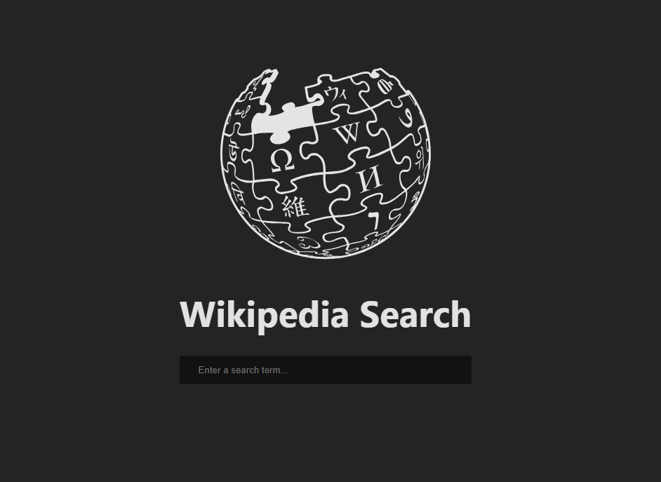
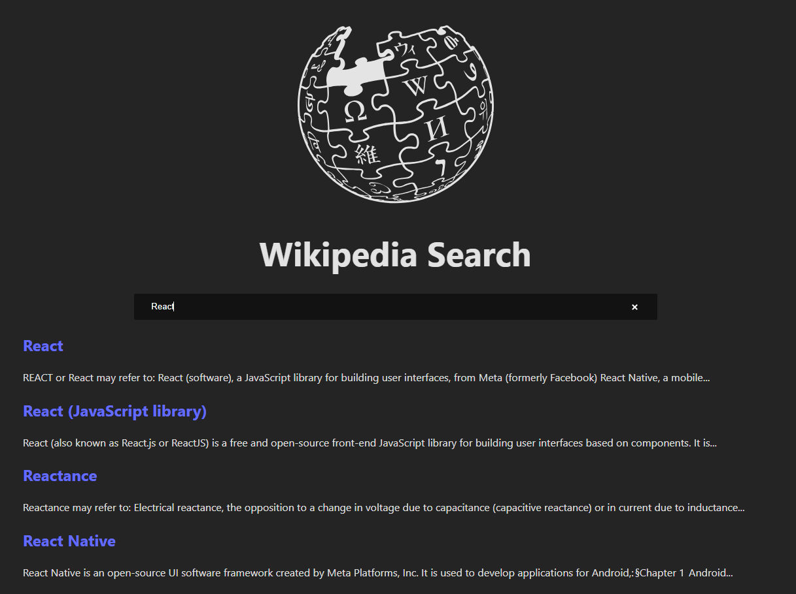

# React + Vite

Today, I got to finally understand an API call in React. I hope to get involved in more projects concerning this very topic because it's used in real world applications.
# Preview

